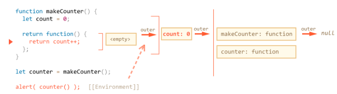

# Advanced working with functions

## Fundamentals
### Parameters
```
function showMessage(from, text) { // arguments: from, text
  alert(from + ': ' + text);
}

showMessage('Ann', 'Hello!'); // Ann: Hello! (*)
showMessage('Ann', "What's up?"); // Ann: What's up? (**)
```
When the function is called in lines (*) and (**), the given values are copied to local variables from and text. Then the function uses them. When the function changes the from and text, it only changes the local copy value, the change is not seen outside.

But when the parameters are object, it only copy the reference. If function changes the object, the outer object will be affected.

### Default values:
default value can be a string or a more complex expression, which is only evaluated and assigned if the parameter is missing:
```
function showMessage(from, text = anotherFunction()) {
  // anotherFunction() only executed if no text given
  // its result becomes the value of text
}
function anotherFunction(){
  return 'default text';
}
```
### Return
A function with an empty return or without it returns `undefined`

### Naming a function
For instance:
```
"get…" – return a value,
"calc…" – calculate something,
"create…" – create something,
"check…" – check something and return a boolean, etc.
```
**one function, one action**

### Function Expression VS Function Declaration
1. Function Declaration:
```
function sum(a, b) {
  return a + b;
}
```
**A Function Declaration is usable in the whole script/code block.**
In other words, when JavaScript prepares to run the script or a code block, it first looks for Function Declarations in it and creates the functions. We can think of it as an “initialization stage”.

And after all of the Function Declarations are processed, the execution goes on.

As a result, a function declared as a Function Declaration can be called earlier than it is defined.

2. Function Expression
```
let sum = function(a, b) {
  return a + b;
};
```
**A Function Expression is created when the execution reaches it and is usable from then on.**

When we need to create a function, the first to consider is Function Declaration syntax. But if a Function Declaration does not suit us for some reason below, then Function Expression should be used.

function declared in a code block can only accessed in that block. If you want to define or change a function inside a code block and call it outside the block, you need to use the function expression:
```
let age = prompt("What is your age?", 18);
let welcome;

if (age < 18) {
  welcome = function() {
    alert("Hello!");
  };
} else {
  welcome = function() {
    alert("Greetings!");
  };
}
welcome(); // ok now
```

### Arrow functions
Arrow function can simplyfy Function Expression:
```
let sum = (a, b) => a + b; // one line function, two argument
let double = n => n * 2; // one line function, one argument
let sayHi = () => alert("Hello!"); // one line function, zero argument
```

## Recursion and stack 递归
when a function calls itself. That’s called recursion.

The information about a function run is stored in its execution context.

The execution context is an internal data structure that contains details about the execution of a function: where the control flow is now, the current variables, the value of this (we don’t use it here) and few other internal details.

One function call has exactly one execution context associated with it.

When a function makes a nested call, the following happens:

* The current function is paused.
* The execution context associated with it is remembered in a special data structure called execution context stack.
* The nested call executes.
* After it ends, the old execution context is retrieved from the stack, and the outer function is resumed from where it stopped.

Note the memory requirements. Contexts take memory. In our case, raising to the power of n actually requires the memory for n contexts, for all lower values of n.

A loop-based algorithm is more memory-saving: **Any recursion can be rewritten as a loop. The loop variant usually can be made more effective.**

Recursive traversals: recursive to traversal multiple level object.

## Rest parameters and spread operator

### Rest parameters:
```
function sumAll(...args) { // args is the name for the array
  let sum = 0;

  for (let arg of args) sum += arg;

  return sum;
}

alert( sumAll(1) ); // 1
alert( sumAll(1, 2) ); // 3
alert( sumAll(1, 2, 3) ); // 6

function showName(firstName, lastName, ...titles) {
  alert( firstName + ' ' + lastName ); // Julius Caesar

  // the rest go into titles array
  // i.e. titles = ["Consul", "Imperator"]
  alert( titles[0] ); // Consul
  alert( titles[1] ); // Imperator
  alert( titles.length ); // 2
}

showName("Julius", "Caesar", "Consul", "Imperator");
```
**The rest parameters must be at the end**

### Spread operator
When ...arr is used in the function call, it “expands” an iterable object arr into the list of arguments.

Use it when you are unsure about the number of the input array.
```
let arr1 = [1, -2, 3, 4];
let arr2 = [8, 3, -8, 1];

alert( Math.max(...arr1) );
alert( Math.max(...arr1, ...arr2) ); // 8

let merged = [0, ...arr1, 2, ...arr2];
alert(merged);

let str = "Hello";
alert( [...str] ); // H,e,l,l,o
```

## Closure
A closure is a function that remembers its outer variables and can access them.

a valid answer to "what is a closure" would be a definition of the closure and an explanation that all functions in JavaScript are closures, and maybe few more words about technical details: the [[Environment]] property and how Lexical Environments work.

### Lexical environment

In JavaScript, every running function, code block, and the script as a whole have an associated object known as the Lexical Environment.

The Lexical Environment object consists of two parts:

* Environment Record – an object that has all local variables as its properties (and some other information like the value of this).
* A reference to the outer lexical environment, usually the one associated with the code lexically right outside of it (outside of the current curly brackets).

An example with returning a function:
```
function makeCounter() {
  let count = 0;

  return function() {
    return count++; // has access to the outer counter
  };
}

let counter = makeCounter();

alert( counter() ); // 0
alert( counter() ); // 1
alert( counter() ); // 2
```
The underlined details:


For every call to makeCounter() a new function Lexical Environment is created, with its own counter. So the resulting counter functions are independent.
```
function makeCounter() {
  let count = 0;
  return function() {
    return count++;
  };
}

let counter1 = makeCounter();
let counter2 = makeCounter();

alert( counter1() ); // 0
alert( counter1() ); // 1

alert( counter2() ); // 0 (independent)
```
More example: https://javascript.info/closure

## The old var

The problems related with `var`:
1. no block-scope
2. hoisting (raising): means that wherever you declare the `var variable`, it will be raised to the top and process it at the beginning, means that you can use the `var variable` before the line that it is declared.
   ```
   function sayHi() {
      phrase = "Hello"; // valid

      if (false) {
         var phrase; // even the if (false) never be reached, the phrase will be decalred at the top.
      }

   alert(phrase); // since var doesn't have block-scope, so phrase is available here.
   }
   ```
3. while the declarations are hoisted, assignments are not:
   ```
   function sayHi() {
      var phrase; // declaration works at the start...

      alert(phrase); // undefined

      phrase = "Hello"; // ...assignment - when the execution reaches it.
   }

   sayHi();
   ```

## Global object
When JavaScript was created, there was an idea of a “global object” that provides all global variables and functions. It was planned that multiple in-browser scripts would use that single global object and share variables through it.

Since then, JavaScript greatly evolved, and that idea of linking code through global variables became much less appealing. In modern JavaScript, the concept of modules took its place.

But the global object still remains in the specification.

In a browser it is named `window`, for Node.JS it is `global`, for other environments it may have another name.

In pre-ES6, we define variable with `var`. If the var is defined in global area, then it becomes a property of the global object and we can read or write to this global variable. But this behaviour is not encouraged to do. 

In ES6, There’s a global Lexical Environment with its Environment Record. And there’s a global object that provides some of the global variables. we are encouraged to declare variables with `let/const`, since the variables they declare are properties of the global Environment Record, but they do not exist in the global object. 

### “this” and global object
1. in the brower, the value of this in the global area is `window`
2. when a function with `this` is called without any object:
   * in non-strict mode: this === window
   * in strict mode: this === undefined
   * if the function is called with an object, this === object

## Function object, NFE
### name property
```
function sayHi() {
  alert("Hi");
}

alert(sayHi.name); // sayHi
```

### Length property
```
function f1(a) {}
function f2(a, b) {}
function many(a, b, ...more) {}

alert(f1.length); // 1
alert(f2.length); // 2
alert(many.length); // 2
```

**polymorphism 多态**
treating arguments differently depending on their type or, in our case depending on the length

### Custom properties
we can add properties to a function, so we can access to this properties outside the function.

**a property is not a variable**
A property assigned to a function like sayHi.counter = 0 does not define a local variable counter inside it. In other words, a property counter and a variable let counter are two unrelated things.

we can use custome property to replace closure in some cases:
```
function makeCounter() {
  // instead of:
  // let count = 0

  function counter() {
    return counter.count++;
  };

  counter.count = 0;

  return counter;
}

let counter = makeCounter();
alert( counter() ); // 0
alert( counter() ); // 1

counter.count = 10;
alert( counter() ); // 10
```
**Difference**: using closure, we can't change count from external code. but using custome property, we can change counter.count externally.

### Named function expression
When the function needs to call itself inside the function, which name we should use to call itself? This is not work:
```
let sayHi = function(who) {
  if (who) {
    alert(`Hello, ${who}`);
  } else {
    sayHi("Guest"); // Error: sayHi is not a function
  }
};

let welcome = sayHi;
sayHi = null;

welcome(); // Error, the nested sayHi call doesn't work any more!
```
so we give the function a local name that will not change:
```
let sayHi = function func(who) {
  if (who) {
    alert(`Hello, ${who}`);
  } else {
    func("Guest"); // use func to re-call itself
  }
};

sayHi(); // Hello, Guest

// But this won't work:
func(); // Error, func is not defined (not visible outside of the function)
```
**Sometimes, when we need a reliable internal name, it’s the reason to rewrite a Function Declaration to Named Function Expression form.**

Functions may carry additional properties. Many well-known JavaScript libraries make great use of this feature.

They create a “main” function and attach many other “helper” functions to it. For instance, the jquery library creates a function named $. The lodash library creates a function _. And then adds _.clone, _.keyBy and other properties to (see the docs when you want learn more about them). Actually, they do it to lessen their pollution of the global space, so that a single library gives only one global variable. That reduces the possibility of naming conflicts.

## The new function syntax

create a function from a string, useful when the function comes from server side, remember to pass the local variables explicitly by passing arguments:
```
let sum = new Function('a', 'b', 'return a + b');

let a = 1, b = 2;

// outer values are passed as arguments
alert( sum(a, b) ); // 3
```

Usually, a function remembers where it was born in the special property [[Environment]]. It references the Lexical Environment from where it’s created.

But when a function is created using new Function, its [[Environment]] references not the current Lexical Environment, but instead the global one.

## Scheduling

### setTimeout and setInterval
with arguments:
```
function sayHi(phrase, who) {
  alert( phrase + ', ' + who );
}

setTimeout(sayHi, 1000, "Hello", "John"); // Hello, John

setTimeout((phrase, who) => {alert( phrase + ', ' + who )}, 2000, "Hello", "emma");
```

### Recursive setTimeout
The recursive `setTimeout` is a more flexible method than `setInterval`. This way the next call may be scheduled differently, depending on the results of the current one.
```
/** instead of:
let timerId = setInterval(() => alert('tick'), 2000);
*/

let timerId = setTimeout(function tick() {
  alert('tick');
  timerId = setTimeout(tick, 2000); // (*)
}, 2000);

// changing interval by setTimeout
let delay = 5000;

let timerId = setTimeout(function request() {
  ...send request...

  if (request failed due to server overload) {
    // increase the interval to the next run
    delay *= 2;
  }

  timerId = setTimeout(request, delay);

}, delay);
```

### setTimeout(func, 0)

* Splitting CPU-hungry tasks: when cpu-heavy task, the code will block, which is bad for brower user since they cannot interact during that block time. But using setTimeout(..,0) to recursively run the piece of the smaller function, in this way, after the break of each small blocked function, the code will excute.
```
<div id="progress"></div>

<script>
  let i = 0;

  function count() {

    // do a piece of the heavy job (*)
    do {
      i++;
      progress.innerHTML = i;
    } while (i % 1e3 != 0);

    if (i < 1e9) {
      setTimeout(count, 0);
    }

  }

  count();
</script>
``` 

## Decorators and forwarding

### decorator
Transparent caching
```
function slow(x) {
  // there can be a heavy CPU-intensive job here
  alert(`Called with ${x}`);
  return x;
}

function cachingDecorator(func) {
  let cache = new Map();

  return function(x) {
    if (cache.has(x)) { // if the result is in the map
      return cache.get(x); // return it
    }

    let result = func(x); // otherwise call func

    cache.set(x, result); // and cache (remember) the result
    return result;
  };
}

slow = cachingDecorator(slow);

alert( slow(1) ); // slow(1) is cached
alert( "Again: " + slow(1) ); // the same

alert( slow(2) ); // slow(2) is cached
alert( "Again: " + slow(2) ); // the same as the previous line
```

In the code above `cachingDecorator` is a decorator: a special function that takes another function and alters its behavior.

The idea is that we can call `cachingDecorator` for any function, and it will return the caching wrapper. That’s great, because we can have many functions that could use such a feature, and all we need to do is to apply cachingDecorator to them.

### Using “func.call” for the context
When the orginal method uses `this`, then after the decorator passes the call the original method, the acutal call will lead to `this` undefined.

There’s a special built-in function method `func.call(context, …args)` that allows to call a function explicitly setting `this`.

```
let worker = {
  someMethod() {
    return 1;
  },

  slow(x) {
    alert("Called with " + x);
    return x * this.someMethod(); // (*)
  }
};

function cachingDecorator(func) {
  let cache = new Map();
  return function(x) {
    if (cache.has(x)) {
      return cache.get(x);
    }
    let result = func.call(this, x); // "this" is passed correctly now
    cache.set(x, result);
    return result;
  };
}

worker.slow = cachingDecorator(worker.slow); // now make it caching

alert( worker.slow(2) ); // works
alert( worker.slow(2) ); // works, doesn't call the original (cached)
```

### func.apply

```
let args = [1, 2, 3];

func.call(context, ...args); // pass an array as list with spread operator
func.apply(context, args);   // is same as using apply
```
If we look more closely, there’s a minor difference between such uses of call and apply.
* The spread operator ... allows to pass iterable args as the list to call.
* The apply accepts only array-like args.

And we know that there is an array-like property called `arguments`, so we can make a function wrapper that forwards call to another function with both context and argument:
```
let worker = {
  slow(min, max) {
    alert(`Called with ${min},${max}`);
    return min + max;
  }
};

function cachingDecorator(func, hash) {
  let cache = new Map();
  return function() {
    let key = hash(arguments); // (*)
    if (cache.has(key)) {
      return cache.get(key);
    }

    let result = func.apply(this, arguments); // (**)

    cache.set(key, result);
    return result;
  };
}

function hash(args) {
  return args[0] + ',' + args[1];
}

worker.slow = cachingDecorator(worker.slow, hash);

alert( worker.slow(3, 5) ); // works
alert( "Again " + worker.slow(3, 5) ); // same (cached)
```

## Function binding

## Currying and partials

## Arrow functions revisited