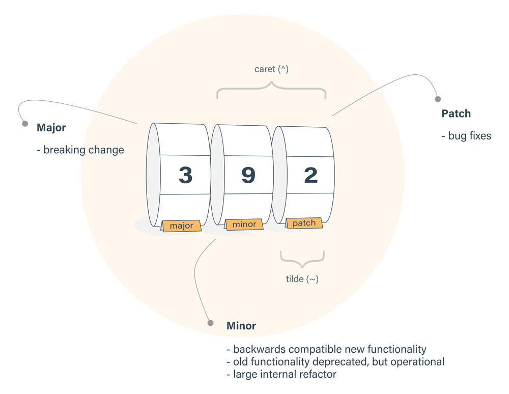

# Nodejs

[what is nodejs](https://medium.freecodecamp.org/what-exactly-is-node-js-ae36e97449f5)
Node.js is a JavaScript runtime environment. It offers JavaScript engine, mainly V8 (same of Chrome).

Check ES implementation of different node version: https://node.green/

## Dev tools

### 1. package management

#### npm VS yarn

**by 2019, npm is better than yarn**

YARN is built by Facebook. 
When YARN was created, it provided `.lock` file to control the package version and was twice faster than NPM. Now, NPM has improved its speed and introduced `.lock` file as well, so these advantages are not there anymore. Besides, YARN is still new and is not as mature as NPM. As a result, we should replace YARN with NPM.
https://medium.com/@vincentnewkirk/npm-vs-yarn-2019-e88757b17038

#### package version
Npm allows installing newer version of a package than the one specified. Using tilde (~) gives you bug fix releases and caret (^) gives you backwards compatible new functionality as well.
The problem is old versions usually don't receive bug fixes that much, so npm uses caret (^) as the default for --save.



* https://stackoverflow.com/a/31733623
* https://docs.npmjs.com/files/package.json

#### package.lock.json

Do I commit the package-lock.json file created by npm 5?

Yes, package-lock.json is intended to be checked into source control. If you're using npm 5, you may see this on the command line: created a lockfile as package-lock.json. You should commit this file.

### 2. use babel to convert node.js to es6
https://hackernoon.com/using-babel-7-with-node-7e401bc28b04
#### install:
```bash
npm install --save-dev @babel/core @babel/cli @babel/preset-env @babel/node
```
#### creating a .babelrc file in our project root
```.babelrc
// .babelrc
{
  "presets": ["@babel/preset-env"]
}
```
#### Adding scripts to package.json
```package.json
"scripts": {
    "start": "babel-node src/server.js",
    "build": "babel src --out-dir dist",
    "serve": "node dist/server.js"
  }
```


### 3. nodemon
[nodemon](https://github.com/remy/nodemon) Monitor for any changes in your node.js application and automatically restart the server.
#### install:
```bash
npm install --save-dev nodemon
```
#### config:
```package.json
"scripts": {
    "start": "nodemon --exec babel-node src/server.js"
  }
```
